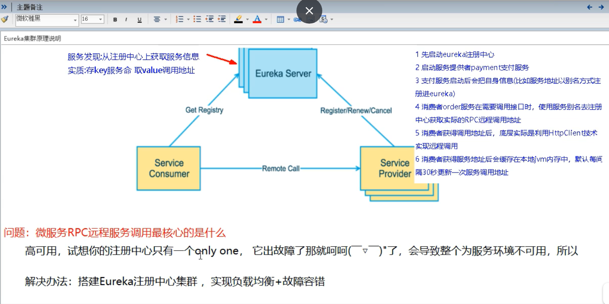
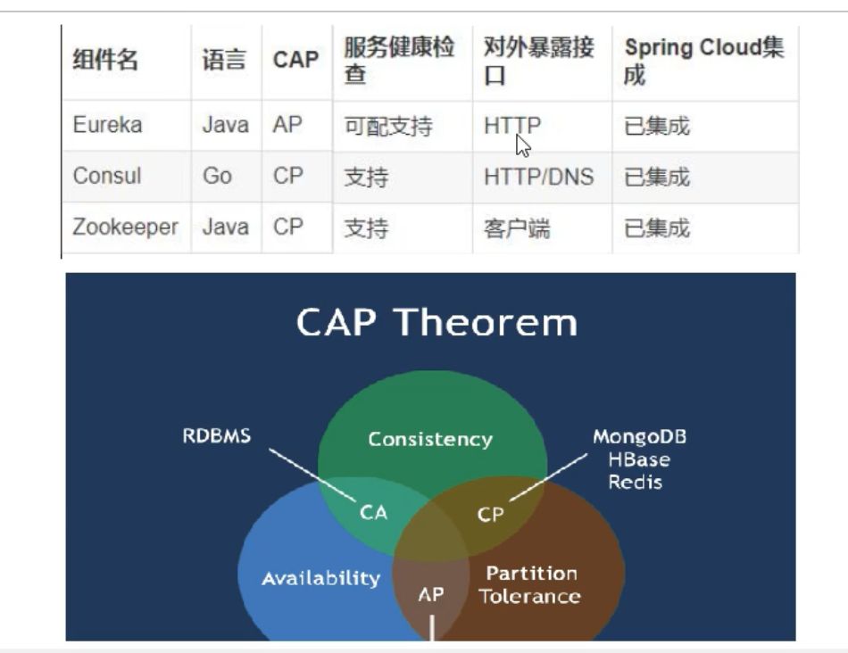
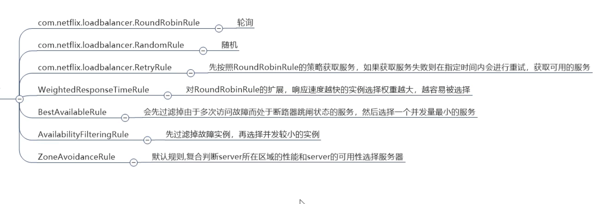
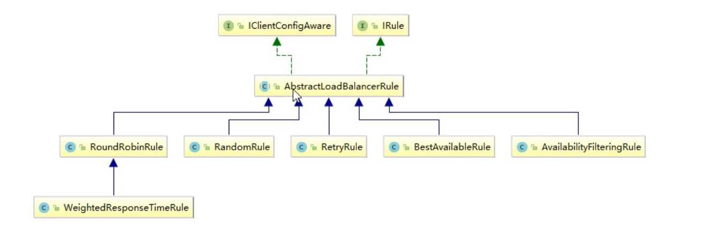
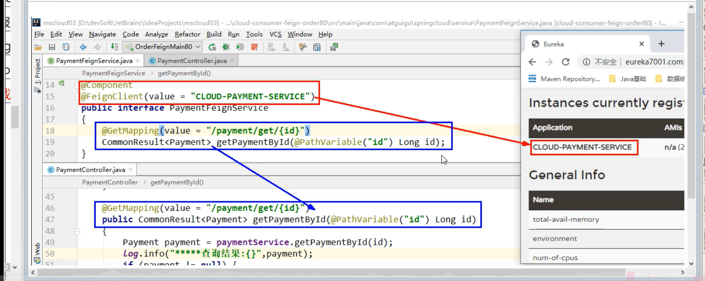
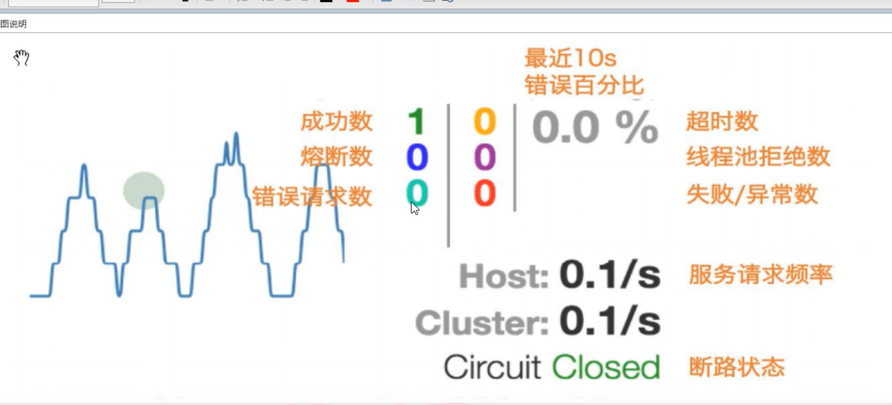
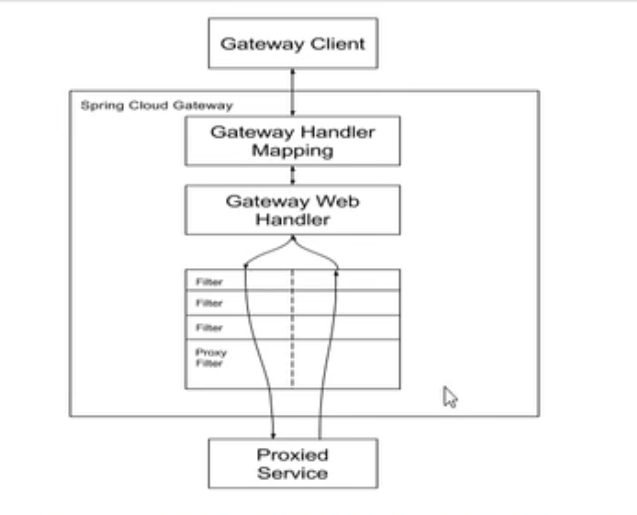

# 注册中心(Eureka,Zookeeper,Consul)
## CAP理论
C - consistency 强一致性<br>
A - availability  可用性<br>
P - partition tolerance 分区容错性<br>
CA - 单点集群，满足一致性，可用性，通常在可拓展性上不太强大<br>
CP - 满足一致性，分区容错性的系统，通常性能不是特别的高<br>
AP - 满足可用性，分区容错性，通过对数据一致性要求低一些。<br>
## Eureka(AP特性)
Eureka包括两个组件:Eureka Service 和 Eureka Client

Eureka Service 提供服务注册服务:<br/>
各个微服务节点通过配置启动后,会在Eureka Service中注册,这样EurekaService中的服务注册表中将会存储所有可用节点的信息,服务节点的信息可以在界面直观的看到.

Eureka Client 通过注册中心进行访问:<br/>
是一个java客户端,用于简化Eureka Ser
vice的交互,客户端同时也具备一个内置的,使用轮询负载算法的负载均衡器.在应用启动后,将会将Eureka Service发送心跳机制(默认周期是30秒).如果Eureka Service在多个心跳周期内没有收到某个节点心跳,Eureka Service将会从服务注册表中把这个服务节点移除(默认90秒)

## 集群Eureka搭建步骤

### 集群注册原理
    相互注册,相互守望
        :就是互相调用(A调用B,B也可以调用A)
    这一部分需要修改映射配置
    修改本地Host文件添加内容:127.0.0.1    eureka7001.com
                           127.0.0.1    eureka7002.com
                           127.0.0.1    eureka7003.com
    修改原因:我们要用到集群,但是物理上我们只有一台机器所有我们要配置这个映射
    ,用不同的端口号来映射同一个地址
### actuator微服务信息完善
完善一些细节问题.
#### 主机名称:服务名称修改
```yaml
eureka:
  client:
    #表示是否将自己注册进EurekaServer默认为true
    register-with-eureka: true
    #是否从EurekaServer抓住已有的注册信息,默认为true.单节点无所谓,集群必须设置为true才能配合ribbon使用负载均衡
    fetch-registry: true
    service-url:
#      defaultZone : http://localhost:7001/eureka  ->以前的单机版
      #集群版
      defaultZone: http://eureka7001.com:7001/eureka,http://eureka7002.com:7002/eureka
  instance:
    instance-id: payment8002 #设置你的主机名称
```
#### 设置IP提示
```yaml
eureka:
  client:
    #表示是否将自己注册进EurekaServer默认为true
    register-with-eureka: true
    #是否从EurekaServer抓住已有的注册信息,默认为true.单节点无所谓,集群必须设置为true才能配合ribbon使用负载均衡
    fetch-registry: true
    service-url:
#      defaultZone : http://localhost:7001/eureka  ->以前的单机版
      #集群版
      defaultZone: http://eureka7001.com:7001/eureka,http://eureka7002.com:7002/eureka
  instance:
    instance-id: payment8001
    prefer-ip-address: true #访问路径可以显示ip地址
```
### 服务发现Discovery
对于注册进eureka里面的微服务,可以通过服务发现来获得该服务的消息

#### DiscoveryClient对象
```java
    //DiscoveryClient这是一个服务发现的对象,发现一些自己的基础信息比如:端口号,服务名
    @Resource
    private DiscoveryClient discoveryClient;
```
#### @EnableDiscoveryClient
主启动类上添加注解开启服务发现功能
```java
@SpringBootApplication
@Slf4j
@EnableEurekaClient
//用于服务发现
@EnableDiscoveryClient
public class PaymentMain8001 {
```
#### 代码实现获取服务信息
```java
@GetMapping(value = "/discovery")
public Object discovery(){
    //获取服务清单列表(方式一)
    List<String> service = discoveryClient.getServices();
    service.forEach(x -> log.info("********" + x));

    //通过服务名获取对应服务名下的Instance实例
    List<ServiceInstance> instances = discoveryClient.getInstances("MICROSERVICECLOUD-PAYMENT-SERVICE");
    instances.forEach(x -> log.info(x.getServiceId() + "\t" + x.getHost() + "\t" + x.getInstanceId() + "\t" + x.getPort() + "\t" + x.getUri()));
    return discoveryClient;
}
```
### Eureka自我保护
概述:<br>
保护模式主要用于一组客户端和Eureka Service之间存在网络分区场景下的保护.
一旦进入保护模式,Eureka Service将会尝试保护其服务注册中心的信息,不再删除
服务注册表中的数据,也就是不会注销任何服务.


为什么会产生Eureka自我保护机制?<br>
为了防止EurekaClient可能正常运行,但是与EurekaService网络不通情况下,EurekaService不会立刻将EurekaClient服务剔除

什么是自我保护模式?<br>
默认情况下,如果EurekaService在一定时间内没有接收到某个微服务实例的心跳,EurekaService将会注销该实例(默认90秒),但是
当网络分区故障发生(延时,卡顿,拥挤)时,微服务与EurekaService之间无法正常通信,以上行为可能变得非常危险了——因为微服务本身
其实是健康的,此时本不应该注销这个服务.Eureka通过"自我保护模式"来解决这个问题——当Eureka节点在短时间内丢失过多客户端时(可能发生网络分区故障),那么这个节点就会进入自我保护机制

在自我保护模式中,Eureka Server会保护服务注册表中的信息,不再注销任何服务实例<br>
它的设计哲学就是宁可保留错误的服务注册信息,也不盲目注销任何可能健康的服务实例.
#### 服务端关闭自我保护机制
```yaml
eureka:
  instance:
    hostname: eureka7001.com #eureka服务端的实例名称
  client:
    #false表示不向注册中心注册自己
    register-with-eureka: false
    #false表示自己端就是注册中心,我的职责就是维护服务器实例,并不需要去检索服务
    fetch-registry: false
    service-url:
      #设置与Eureka Server 交互的地址查询服务和注册服务都需要依赖这个地址
      #通俗易懂的说就是将自己注册到下面这个eureka上去
      #相互守望,相互注册,如果想实现集群高可用,有多台服务器,可以用逗号隔开
      #如果是单机版下面直接写直接的地址就行了
      #defaultZone: http://eureka7002:7002/eureka/ #集群模式->指向其他注册中心
      defaultZone: http://eureka7001:7001/eureka/ #单机模式->指向自己
  server:
    enable-self-preservation: false #关闭自我保护机制
    eviction-interval-timer-in-ms: 2000 #设置默认时间(单位ms)
```
#### 客户端修改心跳时间
```yaml
eureka:
  client:
    #表示是否将自己注册进EurekaServer默认为true
    register-with-eureka: true
    #是否从EurekaServer抓住已有的注册信息,默认为true.单节点无所谓,集群必须设置为true才能配合ribbon使用负载均衡
    fetch-registry: true
    service-url:
#      defaultZone : http://localhost:7001/eureka  ->以前的单机版
      #集群版
      defaultZone: http://eureka7001.com:7001/eureka,http://eureka7002.com:7002/eureka
  instance:
    instance-id: payment8001
    prefer-ip-address: true #访问路径可以显示ip地址
    #Eureka客户端向服务端发送心跳时间间隔,单位为秒(默认为30秒)
    lease-renewal-interval-in-seconds: 1
    #Eureka客户端在收到最后一次心跳后等待时间上限,单位为秒(默认为90秒),超时剔除服务
    lease-expiration-duration-in-seconds: 2
```
## zookeeper替换Eureka整合springCloud(CP特性)
zookeeper节点区分<br>
1.临时节点<br>
2.带序号的临时节点<br>
3.持久节点<br>
4.带序号的持久节点<br>

注意:微服务注册到zookeeper中时是属于临时节点,也就是说它不会像Eureka一样会有自我保护机制,只要某一节点在心跳过程中中断zookeeper就会将该节点剔除.

## Consul
### 能做呢什么
1. 服务注册与发现 -> 提供HTTP和DNS两种发现方式
2. 健康检查 -> 支持多种方式,HTTP,TCP,Docker,Shell脚本定制化
3. KV存储 -> Key、Value的存储方式
4. 多数据中心 -> Consul支持多数据中心
5. 可视化Web界

### 注册与发现
中文教程:https://www.springcloud.cc/spring-cloud-consul.html <br>
基本步骤和zookeeper是一样的
1. 安装Consul
2. pom引包
3. 配置文件,配置地址.
4. 主启动类添加@EnableDiscoveryClient
## 三个注册中心的异同


# 服务调用
## Spring Could Ribbon(负载均衡+RestTemplate调用)
    Spring Cloud Ribbon是基于Netflix Ribbon实现的一套客户端
        主要功能:提供客户端的软件负载均衡算法和服务调用
    
    Ribbon和Nginx的区别:
        Nginx是服务器负载均衡,客户端所有请求都会交给Nginx,然后由Nginx实现转发请求.即负载均衡是由服务端实现的.
        Ribbon本地负载均衡,在调用微服务接口时候,会在注册中心上获取注册信息服务列表之后缓存到JVM本地,从而在本地实现RPC远程服务调用技术
    
    LB(负载均衡):
        集中式负载均衡:
            即在服务的消费方和提供方之间使用独立的LB设施(可以使硬件,如F5,也可以是软件,如Nginx),由该设施负责把访问请求通过某种策略转发至服务的提供方
        进程内负载均衡
            将Lb逻辑集成到消费方,消费方从服务注册中心获知有哪些地址可用,然后自己再从这些地址中挑出来一个合适的服务器.
            Ribbon就属于进程内LB,它只是一个类库,集成于消费方进程,消费方通过它来获取到服务提供方的地址.
            
        Ribbon在工作中分两步
            第一步:先选择EurekaServer,它优先选择在同一个区域内负载较少的server
            第二步:再根据用户指定的策略,在从server取到的服务注册列表中选择一个地址.
            其中Ribbon提供了多种策略:比如轮循,随机和根据响应时间加权.
            
引用↓↓↓↓↓↓↓↓↓
```xml
        <!--Eureka自己集成Ribbon,所以实现了调用的负载均衡功能-->
        <dependency>
            <groupId>org.springframework.cloud</groupId>
            <artifactId>spring-cloud-starter-netflix-eureka-client</artifactId>
        </dependency>
```
## RestTemplate了解
1. 常用方法
    1. getForObject方法/getForEntity方法<br>
        1. getForObject返回对象为响应体中数据转成的对象,基本上可以理解为json
        2. 返回对象为ResponseEntity对象,包含了响应中的一些重要信息,比如响应头,响应状态码,响应体等.
    2. postForObject方法/postForEntity方法
    3. GET请求方法
    4. POST请求方法<br>
## 其他的均衡模式

### 如何替换图片中的模式
配置详情看microservicecloud-consumer-order-80代码<br>
    
    官方文档警告:(默认模式是轮循)
        这个自定义类不能放在@ComponentScan所所扫描的当前包下以及子包下,
        否则我们自定义的这个配置类就会被所有的Ribbon客户端所共享,达不到特殊化定制的目的了.

### 第一步:修改调用者项目(新增配置类)
遵守上一条的规则
```java
/**
 * @author: wangxu
 * @date: 2020/5/10 19:54
 */
@Configuration
public class MySelfRule {
    @Bean
    public IRule myRule(){
        //定义为随机
        return new RandomRule();
    }
}
```
### 第二部:主启动类添加注解
```java
/**
 * @author: wangxu
 * @date: 2020/3/24 20:16
 */
@SpringBootApplication
@Slf4j
@EnableEurekaClient
//name:要访问的服务,configuration:负载均衡模式的配置类
@RibbonClient(name = "microservicecloud-payment-service",configuration = MySelfRule.class)
public class OrderMain80 {
    public static void main(String[] args) {
        SpringApplication.run(OrderMain80.class, args);
        log.info(">>>>>>启动完成<<<<<<<");
    }
}
```
## 负载均衡轮循算法

### 原理(未完待续,知识储备量不足JUC高并发编程--CAS---自旋锁)

# OpenFegin
## 能做些什么
Feign诣在是编写Java Http客户端变得更容易<br>
前面在使用Ribbon + RestTemplate时,利用RestTemplate对http请求的封装处理,形成了一条模板化的调用方法,但是在实际开发中,由于对服务依赖的调用可不止一处,往往一个接口被多次调用
,所以通常都会针对每一个微服务自行进行封装一些客户端类来包装这些依赖服务的调用,所以,Feign在此基础上做了进一步的封装,由他来帮助我们定义和实现依赖服务接口的定义,在Feign的实现下,
我们只需创建一个接口并使用注解的方式来配置它(以前是Dao接口上面标注Mapper注解,现在是一个微服务接口上面标注一个Feign注解即可),即可完成对服务提供方的接口绑定,简化了使用Spring Cloud Ribbon时,
自动封装服务调用客户端的开发量.
    
Feign集成了Ribbon<br>
利用Ribbon维护了Payment的服务列表信息,并且通过轮询实现类客户端的负载均衡,而与Ribbon不同的是,通过feign只需要定义服务绑定接口且以声明式的方法,优雅而简单的实现服务调用.
## 使用方法
详细使用示例microservicecloud-consumer-feign-order-80,——其实看官网是最好的。

## 超时控制
openfeign底层是riddon,客户端一般默认等待一秒钟,如果响应超过1秒会报timeout
```yaml
ribbon:
    #指的是建立连接以后从服务器读取到可用资源所用的时间
    ReadTimeout: 5000
    #指的是建立连接所有的时间,适用于网络状况正常的情况下,连段连接所用的时间
    ConnectTimeout: 5000
```
## 日志增强
### 日志等级
配置日志输出使用openfeign时的一些详细日志.<br>
NONE: 默认的,不显示任何日志
BASIC: 仅记录请求方法、URL、响应状态码及执行时间；
HEADERS: 除了BASIC中定义的信息以外,还有请求和响应的头信息;
FULL: 除了HEADERS中定义的信息之外,还有请求和响应的正文及元数据.
#### 第一步配置一个日志bean
```java
@Configuration
public class FeignConfig {
    @Bean
    Logger.Level feignLoggerLevel(){
        //放回bean并设置日志等级
        return Logger.Level.FULL;
    }
}
```
#### 修改配置文件
```yaml
logging:
  level:
    #feign日志以什么级别哪个接口
    com.wangx.springcloud.service.PaymentFeignService: debug
```
# Hystrix(主要功能:服务降级,服务熔断,服务限流,接近实时的监控)
## 服务雪崩
    分布式系统面临的问题
        复杂分布式体系结构中的应用程序有数十个依赖关系,每一个依赖关系在某些时候不可避免地失败。
    服务雪崩
            多个微服务之间调用的时候，假设微服务A调用微服务B和微服务C,微服务B和微服务C又调用其他的微服务,这就是所谓的"扇出"效应.
        如果扇出的链路上某个微服务的调用响应时间过长或者不可用,对于微服务A的调用就会占用越来越多的系统资源,进而引起系统的崩溃,所谓
        的"雪崩效应"
            对于高流量的应用来说,单一的后端依赖可能会导致所有服务器上的所有资源都在几秒钟内饱和,比失败更糟糕的是,这些应用程序还
        可能导致服务之间的延迟增加,备份队列,线程和其他系统资源紧张,导致整个系统发生更多的级联故障.这些都表示需要对故障和延
        迟进行隔离和管理,以便单个依赖关系的失败,不能取消整个应用程序或系统.所以通常当你发现一个模块下的某个实例失败后,这个时候
        这个模块依然还会接收流量,然后这个有问题的模块还调用了其他的模块,这样就会发生级联故障,或者叫雪崩
            Hystrix是一个用于处理分布式系统的延迟和容错的开源库,在分布式系统中,许多依赖不可避免的会调用失败,比如超时、异常等,
        Hystrix能够保证在一个依赖出问题的情况下,不会导致整体服务失败,避免级联故障,以提高分布式系统的弹性.
            "熔断器"本身事一种开关装置,当某个服务单位发生故障后,通过断路器的故障监控(类似熔断保险丝),向调用方返回一个符合预期的、
            可处理的备选响应,而不是长时间的等待或者抛出调用方无法处理的异常,这样就保证了服务调用方的线程不会被长时间,不必要地占用,
            从而避免了故障在分布式系统中的蔓延,乃至雪崩.
            
## 服务降级
    对方系统不可用了,你需要给我一个兜底的解决方案
        服务器忙,请稍后再试,不让客户端等待并立刻返回一个友好提示,fallback
    哪些情况下会发生服务降级
        1. 程序运行异常
        2. 超时
        3. 服务熔断触发服务降级
        4. 线程池/信号量打满也会导致服务降级
## 服务熔断
    类比保险丝达到最大服务访问后,直接拒绝方法,拉闸限电,然后调用服务降级的方法并返回友好提示
## 服务限流
    秒杀高并发等操作,严禁一窝蜂的过来拥挤,大家排队,一秒钟N个,有序进行
## 常见错误
### 问题
1. 超时导致服务器变慢(转圈) 超时不再等待
2. 出错(宕机或程序运行出错) 出错要有兜底
### 解决
1. 对方服务(8001)超时了,调用者(80)不能一直卡死等待,必须有服务降级
2. 对方服务(8001)宕机了,调用者(80)不能一直卡死等待,必须有服务降级
3. 对方服务(8001)OK了,调用者(80)自己出故障或有自我要求(自己等待时间小于服务提供者),自己处理降级

## 服务降级示例
### 降级配置
#### 服务端8001
第一步:服务类加注解,创建回调方法<br>
注解: @HystrixCommand 在业务类上加上这个注解实现服务降级设置
```java

    package com.wangx.springcloud.service;
    
    import com.netflix.hystrix.contrib.javanica.annotation.HystrixCommand;
    import com.netflix.hystrix.contrib.javanica.annotation.HystrixProperty;
    import org.springframework.stereotype.Service;
    
    import java.util.concurrent.TimeUnit;
    
    /**
     * @author: wangxu
     * @date: 2020/5/16 13:37
     */
    @Service
    public class PaymentService {
        //在业务类上加上这个注解实现服务降级设置
    
        /**
         * fallbackMethod:如果这个方法出事了,就执行paymentInfo_TimeOutHandler这个方法进行兜底
         */
        @HystrixCommand(fallbackMethod = "paymentInfo_TimeOutHandler", commandProperties = {
                //设置超时时错误的时间
                @HystrixProperty(name = "execution.isolation.thread.timeoutInMilliseconds", value = "3000")
        })
        //回调方法
        public String paymentInfo_TimeOut(Integer id) {
    
            int time = 5;
            //报错语句
            int age = 10/0;
            /*try {
                //暂停3秒钟
                TimeUnit.SECONDS.sleep(time);
            } catch (InterruptedException e) {
                e.printStackTrace();
            }*/
            return "线程池: " + Thread.currentThread().getName() + " paymentInfo_TimeOut,id: " + id + "\t" + "O(∩_∩)O哈哈~" + "耗时(秒): " + time;
        }
    
        public String paymentInfo_TimeOutHandler(Integer id){
            return "线程池: " + Thread.currentThread().getName() + " 系统繁忙或者运行报错,请稍后重试,id: " + id + "\t" + "o(╥﹏╥)o";
        }
    
    }
```
第二步:主启动类添加启动断路器注解<br>
注解:@EnableCircuitBreaker 启动断路器功能
```java
package com.wangx.springcloud;

import lombok.extern.slf4j.Slf4j;
import org.springframework.boot.SpringApplication;
import org.springframework.boot.autoconfigure.SpringBootApplication;
import org.springframework.cloud.client.circuitbreaker.EnableCircuitBreaker;
import org.springframework.cloud.client.discovery.EnableDiscoveryClient;

/**
 * @author: wangxu
 * @date: 2020/5/16 13:28
 */
@SpringBootApplication
@EnableDiscoveryClient
@Slf4j
//启动断路器功能
@EnableCircuitBreaker
public class PaymentHystrixMain8001 {
    public static void main(String[] args) {
        SpringApplication.run(PaymentHystrixMain8001.class, args);
        log.info(">>>>>>启动完成<<<<<<<");
    }
}

```
#### 客户端80
第一步:服务类加注解,创建回调方法<br>
```java
/**
 * @author: wangxu
 * @date: 2020/5/16 14:27
 */
@RestController
@Slf4j
@RequestMapping(value = "/consumer/payment")
public class OrderHystixController {
    @Resource
    PaymentHystrixService paymentHystrixService;

    /**
     * fallbackMethod:如果这个方法出事了,就执行paymentInfo_TimeOutHandler这个方法进行兜底
     */
    @HystrixCommand(fallbackMethod = "paymentInfo_TimeOutHandler", commandProperties = {
            //设置超时时错误的时间
            @HystrixProperty(name = "execution.isolation.thread.timeoutInMilliseconds", value = "1500")
    })
    @GetMapping(value = "hystrix/timeout/{id}")
    public String paymentTimeOut_OK(@PathVariable("id") int id) {
        String result = paymentHystrixService.paymentInfo_TimeOut(id);
        log.info("#####result: " + result);
        return result;
    }

    public String paymentInfo_TimeOutHandler(int id){
        return "线程池: " + Thread.currentThread().getName() + " 系统80繁忙或者运行报错,请稍后重试,id: " + id + "\t" + "o(╥﹏╥)o";
    }

}
```
第二步:主启动类添加启动断路器注解<br>
注解: 启动断路器功能和@EnableCircuitBreaker功能是一样的.
```java
/**
 * @author: wangxu
 * @date: 2020/5/16 14:21
 */
@SpringBootApplication
@EnableFeignClients
@Slf4j
//启动断路器功能这个位置和@EnableCircuitBreaker作用是一样的
@EnableHystrix
public class OrderHystrixMain80 {
    public static void main(String[] args) {
        SpringApplication.run(OrderHystrixMain80.class, args);
        log.info(">>>>>>启动完成<<<<<<<");
    }
}
```
#### 配置全局fallback(回调方法)
**如果每一个业务方法对应一个兜底的方法,会造成代码膨胀**<br>
@DefaultProperties注解:配置全局fallback方法<br>
如果出现错误调用全局fallback方法,如果不加这个注解,将不会调用任何回调方法<br>
注意:如果这个注解没有加fallbackMethod参数,就将全局回调方法作为回调方法,如果加了fallbackMethod参数,就用对应的方法作为回调方法

```java
/**
 * @author: wangxu
 * @date: 2020/5/16 14:27
 */
@RestController
@Slf4j
@RequestMapping(value = "/consumer/payment")
//配置全局fallback方法,如果没有发现方法上面的@HystrixCommand,就执行本标签里的方法,如果有@HystrixCommand,就执行他对应的方法
@DefaultProperties(defaultFallback = "payment_Global_FallbackMethod")
public class OrderHystixController {
    @Resource
    PaymentHystrixService paymentHystrixService;

    @GetMapping(value = "hystrix/ok/{id}")
    public String paymentInfo_OK(@PathVariable("id") int id) {
        String result = paymentHystrixService.paymentInfo_OK(id);
        log.info("#####result: " + result);
        return result;
    }

    /**
     * fallbackMethod:如果这个方法出事了,就执行paymentInfo_TimeOutHandler这个方法进行兜底
     * 如果出现错误调用全局fallback方法,如果不加这个注解,将不会调用任何回调方法
     * 注意:如果这个注解没有加fallbackMethod参数,就将全局回调方法作为回调方法,如果加了fallbackMethod参数,就用对应的方法作为回调方法)
     */
    @HystrixCommand(fallbackMethod = "paymentInfo_TimeOutHandler", commandProperties = {
            //设置超时时错误的时间
            @HystrixProperty(name = "execution.isolation.thread.timeoutInMilliseconds", value = "1500")
    })
    @GetMapping(value = "hystrix/timeout/{id}")
    public String paymentInfo_TimeOut(@PathVariable("id") int id) {
        String result = paymentHystrixService.paymentInfo_TimeOut(id);
        log.info("#####result: " + result);
        return result;
    }

    public String paymentInfo_TimeOutHandler(int id){
        return "线程池: " + Thread.currentThread().getName() + " 系统80繁忙或者运行报错,请稍后重试,id: " + id + "\t" + "o(╥﹏╥)o";
    }

    //下面是全局fallback
    public String payment_Global_FallbackMethod(){
        return "Global异常处理信息,请稍后再试,╮(╯▽╰)╭";
    }
}
```
## 服务熔断(三种状态:关闭,半开,开)
熔断机制:是应对雪崩效应的一种微服务链路保护机制,当扇出链路的某个微服务出错不可用或者响应太长时间,会进行服务的降级
,进而熔断该节点微服务的调用,快速返回错误信息,当检测到该节点微服务调用响应正常后,回复调用信息.

在Spring Cloud框架里,熔断机制通过Hystrix实现,Hystrix会监控微服务间调用的状况,
当失败的调用到一定阈值,缺省是5秒内20次调用失败,就会启动熔断机制,熔断机制的注解是@HystrixCommand

### 熔断器示例
```java
/**
 * @author: wangxu
 * @date: 2020/5/16 13:37
 */
@Service
public class PaymentService {
    /**
     * =====================服务熔断示例代码
     */
    @HystrixCommand(fallbackMethod = "paymentCircuitBreaker_fallback",commandProperties = {
            @HystrixProperty(name = "circuitBreaker.enabled",value = "true"),//是否开启断路器
            //下面配置总体10秒钟内访问10次如果失败率达百分之60则跳闸,这里面的所有属性都在HystrixCommandProperties抽象类里面,这里面还提供了很多属性的默认值.
            @HystrixProperty(name = "circuitBreaker.requestVolumeThreshold",value = "10"),//请求次数
            @HystrixProperty(name = "circuitBreaker.sleepWindowInMilliseconds",value = "10000"),//时间窗口期
            @HystrixProperty(name = "circuitBreaker.errorThresholdPercentage",value = "60")//失败率达到多少后跳闸
    })
    public String paymentCircuitBreaker(@PathVariable("id") Integer id) {
        if(id < 0){
            throw new RuntimeException("*****id 不能为负数");
        }
        String serialNumber = IdUtil.simpleUUID();

        return Thread.currentThread().getName() + "\t 调用成功,流水号: " + serialNumber;
    }

    public String paymentCircuitBreaker_fallback(@PathVariable("id") Integer id){
        return "id 不能负数,请稍后重试,╮(╯▽╰)╭ id:" + id;
    }
}
```
### 熔断器检测流程
    @HystrixProperty(name = "circuitBreaker.requestVolumeThreshold",value = "10"),//请求次数
    1.请求次数是否达到配置要求
    @HystrixProperty(name = "circuitBreaker.errorThresholdPercentage",value = "60")//失败率达到多少后跳闸
    2.报错百分比是否达到设置值
    3.如果达到设置报错百分比,短路器将从close变为open
    4.此时所有的请求都无法正常响应
    @HystrixProperty(name = "circuitBreaker.errorThresholdPercentage",value = "60")//失败率达到多少后跳闸
    5.当时间窗口期过了以后,系统会尝试接受请求,如果请求失败,短路器依然是开启转台直到下一个时间窗口期结束,在进行测试.
    如果成功了断路器将改为关闭状态.
    
    断路器的三种状态
        关闭状态（Closed）：断路器关闭，流量可以正常进入
        打开/熔断状态（Open）：断路器打开，即circuit-breaker熔断状态，拒绝所有流量，走降级逻辑
        半开状态（Half-Open）：断路器半开状态，Open状态过一段时间（默认5s）转为此状态来尝试恢复。此状态时：允许有且仅一个请求进入，一旦请求成功就关闭断路器。请求失败就到Open状态（这样再过5秒才能转到半开状态）
        熔断器的状态管理，可以用状态机来实现：
## 服务监控(9001项目)
1. 引包
```xml
<?xml version="1.0" encoding="UTF-8"?>
<project xmlns="http://maven.apache.org/POM/4.0.0"
         xmlns:xsi="http://www.w3.org/2001/XMLSchema-instance"
         xsi:schemaLocation="http://maven.apache.org/POM/4.0.0 http://maven.apache.org/xsd/maven-4.0.0.xsd">
    <parent>
        <artifactId>microservicecloud</artifactId>
        <groupId>org.example</groupId>
        <version>1.0-SNAPSHOT</version>
    </parent>
    <modelVersion>4.0.0</modelVersion>

    <artifactId>microservicecloud-consumer-hystrix-dashhoard-9001</artifactId>

    <dependencies>
        <!--Hystrix的仪表盘图形化界面-->
        <dependency>
            <groupId>org.springframework.cloud</groupId>
            <artifactId>spring-cloud-starter-netflix-hystrix-dashboard</artifactId>
        </dependency>
        <dependency>
            <groupId>org.springframework.boot</groupId>
            <artifactId>spring-boot-starter-actuator</artifactId>
        </dependency>
        <dependency>
            <groupId>org.springframework.boot</groupId>
            <artifactId>spring-boot-devtools</artifactId>
            <scope>runtime</scope>
            <optional>true</optional>
        </dependency>
        <dependency>
            <groupId>org.projectlombok</groupId>
            <artifactId>lombok</artifactId>
            <optional>true</optional>
        </dependency>
        <dependency>
            <groupId>org.springframework.boot</groupId>
            <artifactId>spring-boot-starter-test</artifactId>
            <scope>test</scope>
        </dependency>
    </dependencies>

</project>
```
2. 主启动类添加新注解@EnableHystrixDashboard
```java
@SpringBootApplication
//开启Hystrix的仪表盘图形化界面
@EnableHystrixDashboard
public class HystrixDashboardMain9001 {
    public static void main(String[] args) {
        SpringApplication.run(HystrixDashboardMain9001.class, args);
    }

}
```
3. 注意如果想在图像化界面看到,所有提供的微服务必须依赖监控jar包
```xml
<dependency>
    <groupId>org.springframework.boot</groupId>
    <artifactId>spring-boot-starter-actuator</artifactId>
</dependency>
```
4. 并且配置一个在主启动类,配置一个bean,或者yml中配置一个参数,不然图像图像化界面中监控不到服务(8001)
```java
    @SpringBootApplication
    @EnableEurekaClient
    @EnableCircuitBreaker
    public class PaymentHystrixMain8001
    {
        public static void main(String[] args) {
                SpringApplication.run(PaymentHystrixMain8001.class, args);
        }
    
    
        /**
         *此配置是为了服务监控而配置，与服务容错本身无关，springcloud升级后的坑
         *ServletRegistrationBean因为springboot的默认路径不是"/hystrix.stream"，
         *只要在自己的项目里配置上下面的servlet就可以了
         */
        @Bean
        public ServletRegistrationBean getServlet() {
            HystrixMetricsStreamServlet streamServlet = new HystrixMetricsStreamServlet();
            ServletRegistrationBean registrationBean = new ServletRegistrationBean(streamServlet);
            registrationBean.setLoadOnStartup(1);
            registrationBean.addUrlMappings("/hystrix.stream");
            registrationBean.setName("HystrixMetricsStreamServlet");
            return registrationBean;
        }
    }
```
#### 图形化界面怎么看


## 网关
### zuul和gateway(Spring自己出的网关)区别
    为什么会出现gatway?(记录日期2020年5月22日13:43:08)
    一方面zuul2一直跳票,原有的zuul1性能有些跟不上了.
    Gateway使用的(WebFlux)是非阻塞模式.所以更快.
### 什么是gateway
    GateWay是基于<异步非阻塞模式!!>上进行开发的,性能方面不需要担心.

    SpringCloud的全新项目,基于Spring 5.0 + Spring Boot 2.0和project Reactor等技术开发的网关,
    它旨在为了微服务架构提供一种简单有效的统一的API路由管理方式

    SpringCloud Gateway 作为 Spring Cloud 生态系统中的网关,目标是替代Zuul,
    在SpringCloud 2.0以上版本中,没有对新版本的Zuul2.0以上最新高性能版本进行集成,
    仍然还是使用的Zuul 1.x非Reactor模式的老版本,而为了提高网关性能,
    SpringCloud Gateway是基于WebFlux框架实现的,而WebFlux框架底层则使用了高性能的Reactor模式通信架构Netty

    SpringCloud Gateway的目标提供统一的路由方式且基于Filter链的方式提供了网关基本的功能,例如:安全,监控/指标,和限流
### 什么是同步、异步、阻塞、非阻塞状态
    阻塞和非阻塞是指进程访问的数据如果尚未就绪，进程是否需要等待，简单说这相当于函数内部的实现区别，也就是未就绪时是直接返回还是等待就绪。
    
    而同步和异步是指访问数据的机制,同步一般指主动请求并等待I/O操作完毕的方式,当数据就绪后在读写的时候必须阻塞,异步则指主动请求数据后便可以继续处理其它任务,
    随后等待I/O,操作完毕的通知,这可以使进程在数据读写时也不阻塞。
### GateWay特性
动态路由:能匹配任何请求属性
可以对路由指定Predicate(断言)和Filter(过滤器)
集成Hystrix的断路器功能;
集成SpringCloud服务发现功能;
易于编写的Predicate(断言)和Filter(过滤器)
请求限流功能
支持路径重写.
### 三大核心概念
#### 基本流程
客户端向SpringCloud Gateway发出请求,然后在GateWay Handler Mapping中找到与请求相匹配的路由,将其发送到Gateway WebHandler.

Handler再通过指定的过滤器链来将请求发送到我们实际的服务执行业务逻辑,然后返回.
过滤器之间用虚线分开是因为过滤器可能会在发送代理请求之前或之后执行业务逻辑.

web请求,通过一些匹配条件,定位到真正的服务节点,并在这个转发过程的前后,进行一些精细化控制,Predicate就是我们匹配条件;而filter,就是可以理解为一个无所不能的拦截器,有了这两个元素,再加上目标uri,就可以实现一个具体的路由
#### 路由
    个人理解：某个请求是进入哪一个服务（服务级别）
    比喻：某人要上高中，要去哪一所高中
    基本介绍:路由是构建网关的基本模块,它由ID,目标URI,一系列的断言和过滤器组成,如果断言为true则匹配该路由
#### 断言
    个人理解：该请求是否有资格访问某个服务的接口（接口级别）
    比喻：选中高中后，你是哪个班的成员？不是二班的成员不可以进入（不符合访问该接口的条件，不允许访问）
    基本介绍:参考的是java8的java.util.function.Predicate
    开发人员可以匹配HTTP请求的所有内容(例如请求头或请求参数),如果请求与断言相匹配则进行路由
#### 过滤器
    个人理解：最后一层校验他无所不能，他可能以各种条件进行拦截
    基本介绍:指的是Spring框架中GatewayFilter的实例,使用过滤器,可以在请求被路由前或者之后对请求进行修改
#### 示例
新建网关microservicecloud-getaway-9527

为microservicecloud-provider-payment-8001设置网关
```yaml
server:
  port: 9527

spring:
  application:
    name: microservicecloud-getaway
  cloud:
    gateway:
      routes:
        - id: payment_routh #payment_route    #路由的ID，没有固定规则但要求唯一，建议配合服务名
          uri: http://localhost:8001          #匹配后提供服务的路由地址
          predicates:
            - Path=/payment/get/**         # 断言，路径相匹配的进行路由

        - id: payment_routh2 #payment_route    #路由的ID，没有固定规则但要求唯一，建议配合服务名
          uri: http://localhost:8001          #匹配后提供服务的路由地址
          predicates:
            - Path=/payment/lb/**         # 断言，路径相匹配的进行路由
            #- After=2020-02-21T15:51:37.485+08:00[Asia/Shanghai]
            #- Cookie=username,zzyy
            #- Header=X-Request-Id, \d+  # 请求头要有X-Request-Id属性并且值为整数的正则表达式

eureka:
  instance:
    hostname: microservicecloud-gateway-service
  client: #服务提供者provider注册进eureka服务列表内
    service-url:
      register-with-eureka: true
      fetch-registry: true
      defaultZone: http://eureka7001.com:7001/eureka
```